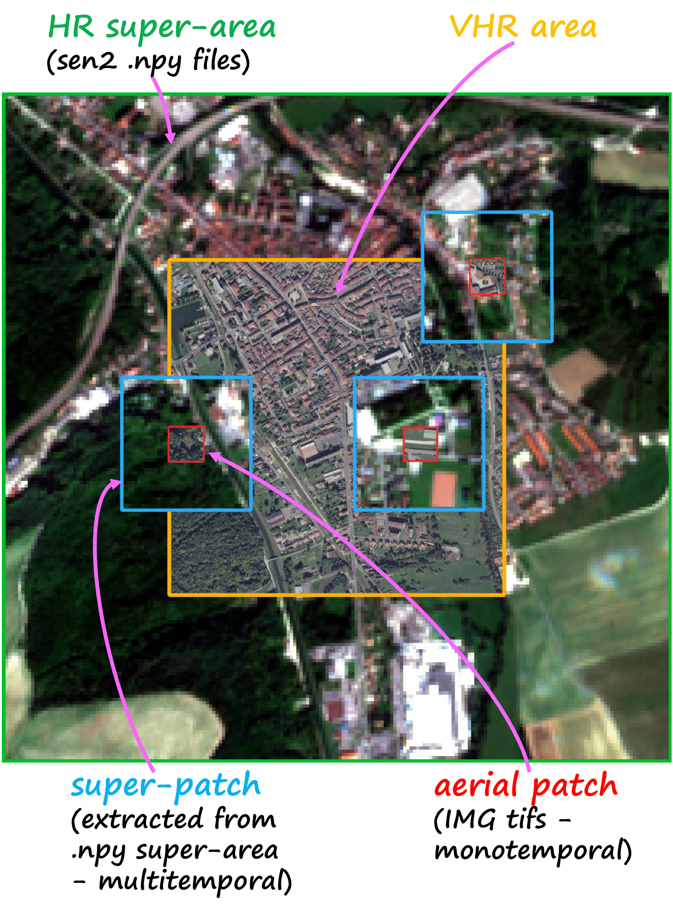
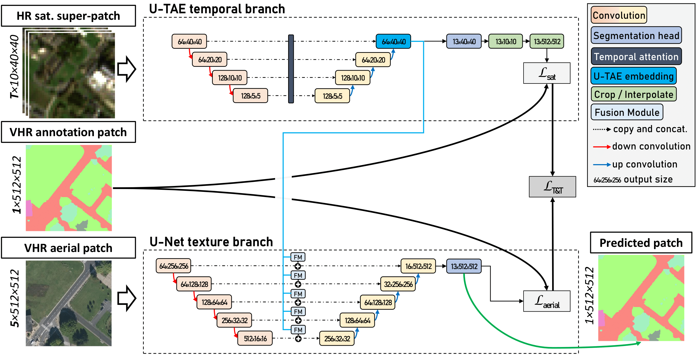
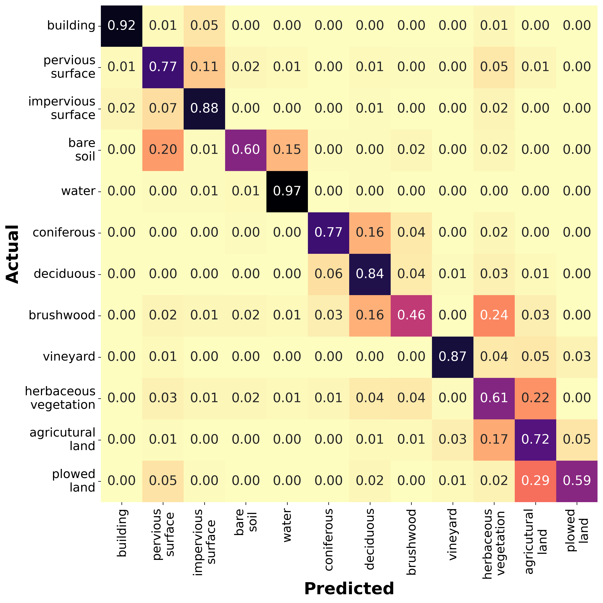

<div align="center">

# FLAIR #2:
# multi-source optical imagery and semantic segmantation


 [](https://github.com/IGNF/FLAIR-1-AI-Challenge/blob/master/LICENSE) <a href="https://pytorch.org/get-started/locally/"></a>
<a href="https://pytorchlightning.ai/"></a> &emsp;  [](https://github.com/etalab/licence-ouverte/blob/master/open-licence.md)


Participate in obtaining more accurate maps for a more comprehensive description and a better understanding of our environment! Come push the limits of state-of-the-art semantic segmentation approaches on a large and challenging dataset. Get in touch at ai-challenge@ign.fr


</div>


<div style="border-width:1px; border-style:solid; border-color:#d2db8c; padding-left: 1em; padding-right: 1em; ">
  
<h2 style="margin-top:5px;">Links</h2>


- **Datapaper : https://arxiv.org/pdf/2305.14467.pdf** 

- **Dataset links :** https://ignf.github.io/FLAIR/#FLAIR2

- **Challenge page : https://codalab.lisn.upsaclay.fr/competitions/13447** [🛑 closed!]

</div>
<br><br>


## Context & Data

The FLAIR #2 dataset is sampled countrywide and is composed of over 20 billion annotated pixels of very high resolution aerial imagery at 0.2 m spatial resolution, acquired over three years and different months (spatio-temporal domains). Aerial imagery patches consist of 5 channels (RVB-Near Infrared-Elevation) and have corresponding annotation (with 19 semantic classes or 13 for the baselines). Furthermore, to integrate broader spatial context and temporal information, high resolution Sentinel-2 1-year time series with 10 spectral band are also provided. More than 50,000 Sentinel-2 acquisitions with 10 m spatial resolution are available.
<br>

<p align="center">
  
  <br>
  <em>Spatial definitions of the FLAIR #2 dataset.</em>
</p>


<p align="center">
  
  <br>
  <em>Example of input data (first three columns are from aerial imagery, fourth from Sentinel-2) and corresponding supervision masks (last column).</em>
</p>

<br><br>
## Baseline model 

A two-branch architecture integrating a U-Net <a href="https://github.com/qubvel/segmentation_models.pytorch"></a> with a pre-trained ResNet34 encoder and a U-TAE <a href="https://github.com/VSainteuf/utae-paps"></a> encompassing a temporal self-attention encoder is presented. The U-TAE branch aims at learning spatio-temporal embeddings from the high resolution satellite time series that are further integrated into the U-Net branch exploiting the aerial imagery. The proposed _U-T&T_ model features a fusion module to extend and reshape the U-TAE embeddings in order to add them towards the U-Net branch.   

<p align="center">
  
  <br>
  <em>Overview of the proposed two-branch architecture.</em>
</p>

<br><br>

## Usage 

The `flair-2-config.yml` file controls paths, hyperparameters and computing ressources. The file `requirement.txt` is listing used libraries for the baselines.

To launch a training/inference/metrics computation, you can either use : 

- ```
  main.py --config_file=flair-2-config.yml
  ```

-  use the `./notebook/flair-2-notebook.ipynb` notebook guiding you through data visualization, training and testing steps.

A toy dataset (reduced size) is available to check that your installation and the information in the configuration file are correct.

<br><br>

## Leaderboard

Please note that for participants to the FLAIR #2 challenge on CodaLab, a certain number of constraints must be satisfied (in particular, inference time). All infos are available on the _Overview_ page of the competion.

| Model|Input|mIoU 
------------ | ------------- | -------------
| baseline U-Net (ResNet34) | aerial imagery | 0.5470
| baseline U-Net (ResNet34) + _metadata + augmentation_ | aerial imagery | 0.5593
|||
| baseline U-T&T | aerial and satellite imagery | 0.5594
| baseline U-T&T + _filter clouds + monthly averages + data augmentation_ | aerial and satellite imagery | 0.5758

If you want to submit a new entry, you can open a new issue.
<b> Results of the challenge will be reported after the end of the challenge early October! </b>

The baseline U-T&T + _filter clouds + monthly averages + data_augmentation_ obtains the following confusion matrix: 

<br><br>
<p align="center">
  
  <br>
  <em>Baseline confusion matrix of the test dataset normalized by rows.</em>
</p>


<br><br><br>

## Reference
Please include a citation to the following article if you use the FLAIR #2 dataset:

```bibtex
@inproceedings{ign2023flair2,
      title={FLAIR: a Country-Scale Land Cover Semantic Segmentation Dataset From Multi-Source Optical Imagery}, 
      author={Anatol Garioud and Nicolas Gonthier and Loic Landrieu and Apolline De Wit and Marion Valette and Marc Poupée and Sébastien Giordano and Boris Wattrelos},
      year={2023},
      booktitle={Advances in Neural Information Processing Systems (NeurIPS) 2023},
      doi={https://doi.org/10.48550/arXiv.2310.13336},
}
```

## Acknowledgment
This work was performed using HPC/AI resources from GENCI-IDRIS (Grant 2022-A0131013803). This work was supported by the project "Copernicus / FPCUP” of the European Union, by the French Space Agency (CNES) and by Connect by CNES.<br>


## Dataset license

The "OPEN LICENCE 2.0/LICENCE OUVERTE" is a license created by the French government specifically for the purpose of facilitating the dissemination of open data by public administration. 
If you are looking for an English version of this license, you can find it on the official GitHub page at the [official github page](https://github.com/etalab/licence-ouverte).

As stated by the license :

### Applicable legislation

This licence is governed by French law.

### Compatibility of this licence

This licence has been designed to be compatible with any free licence that at least requires an acknowledgement of authorship, and specifically with the previous version of this licence as well as with the following licences: United Kingdom’s “Open Government Licence” (OGL), Creative Commons’ “Creative Commons Attribution” (CC-BY) and Open Knowledge Foundation’s “Open Data Commons Attribution” (ODC-BY).
